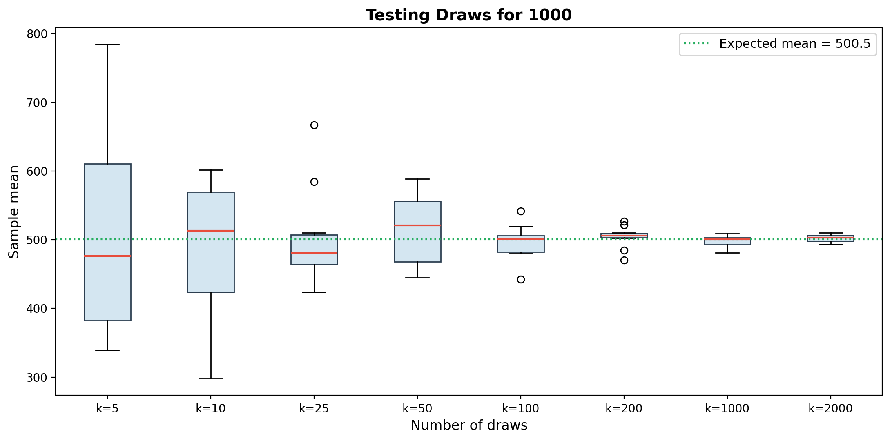

# Law of Large Numbers Demo

Snakemake pipeline demonstrating LLN convergence via boxplots.

## Setup

```
pip install matplotlib snakemake
```

## Run

```bash
snakemake --cores 4
```

## Configure

Edit `params.yaml`:

```yaml
range_max: 1000                                  # sample from [1, range_max]
draw_sizes: [5, 10, 25, 50, 100, 200, 1000, 2000]  # k values
num_trials: 10                                   # repeats per k
```

Change `range_max` to 2000 or add draw sizes — re-run snakemake.

## Output

- `output/data/draws_*.csv` — raw simulation data
- `output/convergence.png` — boxplot


